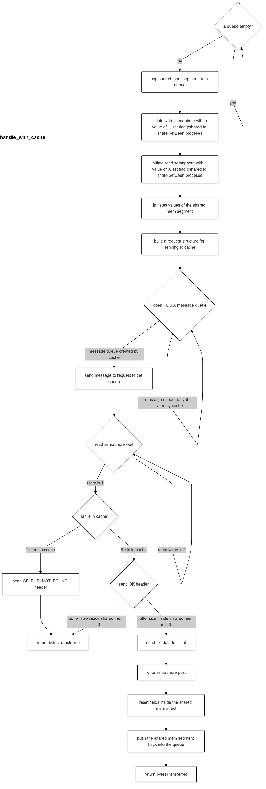
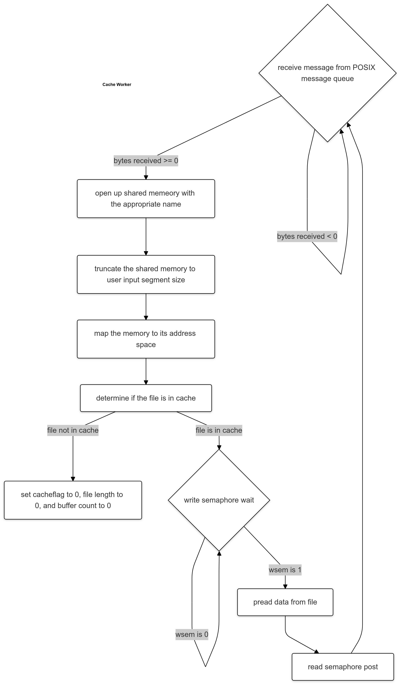

# Project 3 Inter-Process Communication (IPC) README file
Jason Kahei Tam CS6200 Fall 2024

## Part 1 Proxy Server
This part of the project is extending previous simple client-server model into a client-proxy-server model. 

### Design
The handle_with_curl function is the main focus of this part. It uses the libcurl easy interface to communicate the GETFILE requests to the server. 

### Implementation
The implemenation essentially follows the steps outlined in the libcurl easy documentation. The "simple" example on the libcurl website demonstrates the essential steps.

The steps are: 
```
curl_easy_init()      //initiate/allocate a curl
curl_easy_setopt()    //sets the options for the curl. Options include the file path, redirection, sets the callback function and defining the data pointer to the callback
curl_easy_perform()   //performs the network transfer
curl_easy_getinfo()   //used to obtain the response code from the HTTP request
```
If the ```curl_easy_getinfo()``` return value is not ```CURLE_OK``` then a ```SERVER_FAILURE``` is returned.
If the response code is successful then ```gfs_sendHeader()``` and ```gfs_send()``` is called.
Lastly, ```curl_easy_cleanup()``` is called to free all resources.

The callback function also came from the libcurl website. It utilizes a memory structure called ```chunk``` in my code to store the file size and file contents.

I did not consider using another method to communicate with the server i.e. the libcurl multi interface". The multi interface allows multiple simulataneous transfers in a single thread, a non-blocking API. This multi feature was not necessary for this project, the thread is only transferring one file.

### Testing
In order to test locally, the url was hardcoded to the ```data_dir``` variable for concatenation. Two terminals were opened, ./webproxy is called in one terminal, ./gfclient_download -p 16642 is called in the second terminal.

## Part 2 Cache
This part of the project is extending previous simple client-server model into a client-proxy-cache-server model. The parts that was worked on is the proxy and cache.

### Design
An overview is as follows:
The proxy uses a boss-worker multithread to handle the requests from the client. The proxy workers threads uses shared memory segments to obtain information from the cache. A request structure is then built and sent to the cache using the POSIX message queue interface. The cache receveies the request, checks if the file is in cache and write the file information to the shared memory. The proxy threads and the cache uses semaphores to make sure that there is no conflict when using the shared memory segment.

### Implementation
Proxy Implementation:
The proxy is in a boss-worker model with the boss doing the least work as much as possible. The only work the boss is working is opening up shared memory segments according to a pre-defined name format, mapping shared memory to its address space, and queueing the segment to a linked list. The boss also responds to SIGINT ad SIGTERM signals. In earlier versions, I was calling shm_open and mmap in both the boss and worker, this is not needed since they share address space. The worker threads handles the bulk of the work in the handle_with_cache function, see below for a activity diagram of handle_with_cache. One part I want to hightlight is the use of semaphores to ensure there is no conflict between the proxy reading the file data and the cache writing the file data. One design choice is: given N segments of size S, I created N shared memory regions that are each size S. This is instead of: Given N segments of size S, cree one large shared memory regions that is size N*S. I did not use the latter method of shared memory since I wanted to avoid doing the math to find each segment struct.

Cache Implementation:
The cache is also in a boss-worker model with the boss doing the least work as much as possible. The boss only has two tasks: opening the message queue and initiating the worker threads. The worker threads are doing the bulk of the work. One design choice I made is to put the mq_receive inside the worker threads, this was made based on slack discussion between my peers that this would result in faster execution times. Also, less memory is used. If the cache boss calls mq_receive, then message received will need to be stored in a queue, and mutex will need to be used between the worker threads to access the queue. 

The cache worker opens shared memory and maps them to its address space. It then receives the message from the POSIX message queue and determines if the file is in the cache. It will then write the appropriate data to the shared memory segment while using semaphores for synchronization. The worker write the file data to the shared memory using pread since it is thread safe. Please see below for an activity diagram of the cache worker.





### Testing
Testing was done using 6200-tools. Base, Parameter, Stress, and Soak cases was used  https://github.gatech.edu/cparaz3/6200-tools/
I did my own testing as well with three terminals
```
./webproxy -p desiredportnumber -t numthreads , 1 and multiple threads were tested
./simplecached
./gfclient_download -p portnumber -t numthreads, 1 and multiple threads were tested
```

## References for all parts of Project 1
Part 1
- libcurl documentation pages helped a lot for part 1 of the project. https://curl.se/libcurl/c/libcurl-easy.html, The libcurl webpages for each function is not listed here for brevity.
- https://curl.se/libcurl/c/simple.html : a simple example provided by libcurl for the easy interface
- https://stackoverflow.com/questions/55078102/libcurl-easy-vs-multi-interface : information about comparing multi to easy libcurl
- https://curl.se/libcurl/c/CURLOPT_WRITEFUNCTION.html*/ : The call function template

Part 2
- Class Piazza posts and Slack helped me immensely in. https://piazza.com/class/lzwveb5orfe6by/post/869, https://piazza.com/class/lzwveb5orfe6by/post/790
- Testing suits from classmates and instructor, provided on Piazza CS6200-tools
- https://man7.org/, especially https://man7.org/conf/lca2013/IPC_Overview-LCA-2013-printable.pdf: used to understand the the shared memory calls, messauge queue, and semaphore calls
- https://w3.cs.jmu.edu/kirkpams/OpenCSF/Books/csf/html/ShMem.html: helped in understanding shared memory
- https://w3.cs.jmu.edu/kirkpams/OpenCSF/Books/csf/html/IPCSems.html: helped in understanding semaphores
- https://w3.cs.jmu.edu/kirkpams/OpenCSF/Books/csf/html/MQueues.html: helped in understanding message queue
- https://www.gnu.org/software/libc/manual/html_node/Permission-Bits.html: understanding the permission bits in for message queue
- https://stackoverflow.com/questions/238603/how-can-i-get-a-files-size-in-c and slack post: refresher on using fstat to obtain file size
- https://stackoverflow.com/questions/23146950/c-semaphore-sem-getvalue-not-returning-what-im-expecting: helepd in figuring out the value of a semaphore


